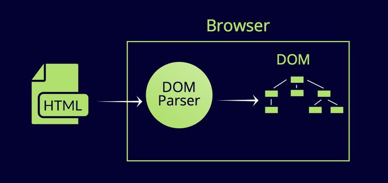

# Manipulasi DOM


## 1. Penjelasan DOM

DOM (Document Object Model) merupakan object yang berisi struktur dari halaman web kita. DOM berasal dari script HTML yang telah dimuat di browser.



## 2. Mengenal DOM Nodes, Collection, dan Node List

### 2.1. DOM Nodes (HTML Elements)

dengan javascript kita dapat merubah atau memanipulasi struktur web, sebagai contoh disini kita akan mencoba untuk menambahkan node ke dalam struktur HTML yang telah ada

```html
<div id="div1">
  <p id="p1">This is a paragraph.</p>
  <p id="p2">This is another paragraph.</p>
</div>
```

```js
// digunakan untuk membuat element(node) baru
const para = document.createElement("p");
const node = document.createTextNode("This is new.");

// disini kita mencoba manmbahkan node baru kedalam para menggunakan method "appendChild"
para.appendChild(node);

const element = document.getElementById("div1");
element.appendChild(para);
```

#### Hasil dari kode diatas


### 2.1. Collections (HTML Collections)

HTML Collection merupakan daftar <b> seperti</b> array yang berisi kumpulan dari HTML Elements. Berikut merupakan beberapa macam function yang mereturn HTML Collections

- getElementsByTagName()

- getElementsByClassName()

#### Contoh:

```js
// fungsi ini akan mereturn element "p" sesuai jumlah p dari HTML
const myCollection = document.getElementsByTagName("p");

// kita dapat mengakses elementnya menggunakan indexnya
myCollection[1];

// karena "seperti" array maka kita dapat menggunakan method-method tertentu
// contoh menggunakan method length
myCollection.length;
```

#### PENTING!!!!

- HTMLCollection mungkin terlihat seperti array, tetapi sebenarnya tidak
- anda dapat menggunakan looping untuk mengakses element (seperti array)
- namun kamu tidak dapat menggunakan array method seperti valueOf(), pop(), push(), or join()

### 2.1.NodeList

## 3. Manipulasi DOM dengan Javascript

Setelah DOM berhasil dimuat di browser, maka kita bisa melakukan manipulasi dengan menggunakan javascript

### 3.1. Menentukan Element

Sebelum memanipulasi dom, kita perlu menentukan element apa yang akan kita manipulasi

```javascript
// Mencari element berdasarkan ID
document.getElementById("id");

// Mencari element berdasarkan nama tag
document.getElementsByTagName("tagName");

// Mencari element berdasarkan class
document.getElementsByClassName("className");
```

### 3.2. Manipulasi Element

Setelah mendapatkan element yang ingin kita manipulasi, maka kita bisa langsung melakukan manipulasi pada element tersebut

```javascript
var element = document.getElementById("header");

// merubah isi dari element
element.innerHTML = value;

// merubah style dari element
element.style.property = value;
```

### 3.3. Merubah Class Element

Merubah style dari suatu element secara langsung kurang dianjurkan, lebih baik merubah class dari element tersebut dengan menggunakan `classList`

```javascript
var element = document.getElementById("header");

// mendapatkan nama class pada element (berupa array)
element.classList;

// menambah class pada element
element.classList.add("className");

// menghapus class pada element
element.classList.remove("className");

// toggle class pada element
element.classList.toggle("className");

// memeriksa apakah element memiliki class
element.classList.contains("className");

// mendapatkan jumlah class pada element
element.classList.length;

// mendapatkan class pertama pada element
element.classList.item(0);
```
